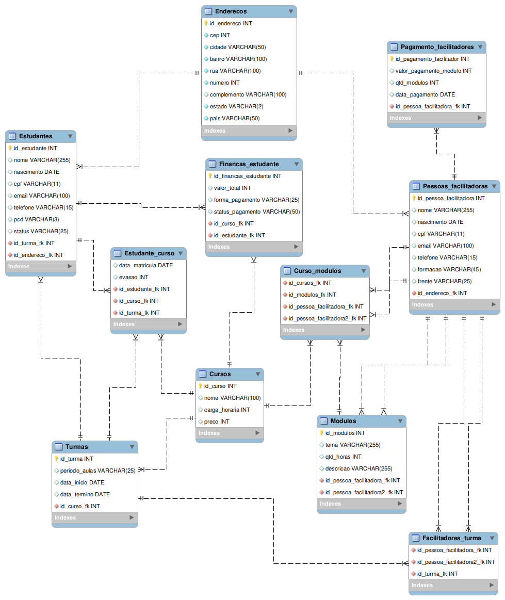

# 💛ResiliaDB
Projeto em Grupo para conclusão do Módulo 03, realizado pela Squad 09 da turma do Códigos do Amanhã. 

## 📌Objetivo:
O projeto de modernização do banco de dados da Resilia visa centralizar e otimizar o armazenamento de informações relacionadas aos estudantes, pessoas facilitadoras, turmas, módulos e cursos. Isso permitirá uma gestão mais eficaz dos dados, além de fornecer uma base para a geração de relatórios e análises que irão subsidiar decisões estratégicas da empresa.

## 📊Estrutura do Banco de Dados:
1. `Enderecos`: Armazena informações de endereços, como CEP, cidade, bairro, rua, número, complemento, estado e país.
2. `Pessoas_facilitadoras`: Contém dados das pessoas facilitadoras, incluindo nome, data de nascimento, CPF, email, telefone, formação e frente de atuação. Possui relação com a tabela `Enderecos`.
3. `Modulos`: Armazena informações sobre os módulos ministrados, como tema, quantidade de horas, descrição e pessoas facilitadoras responsáveis. Tem relação com a tabela `Pessoas_facilitadoras`.
4. `Cursos`: Contém detalhes dos cursos oferecidos, como nome, carga horária e preço.
5. `Turmas`: Armazena informações sobre as turmas, incluindo período de aulas, data de início, data de término e o curso associado.
6. `Estudantes`: Contém dados dos estudantes, como nome, data de nascimento, CPF, email, telefone, informações sobre necessidades especiais e status. Relaciona-se com a tabela `Enderecos` e `Turmas`.
7. `Estudante_curso`: Registra informações sobre a matrícula dos estudantes em cursos, incluindo data de matrícula, evasão e relacionamentos com as tabelas `Estudantes`, `Cursos` e `Turmas`.
8. `Facilitadores_turma`: Mantém o registro das pessoas facilitadoras associadas às turmas.
9. `Curso_modulos`: Estabelece a relação entre cursos, módulos e pessoas facilitadoras.
10. `Pagamento_facilitadores`: Armazena informações sobre os pagamentos aos facilitadores, incluindo valor, quantidade de módulos e data.
11. `Financas_estudante`: Registra dados financeiros dos estudantes, como valor total, forma de pagamento e status. 

## 🖥️Utilização:
-Após certificar-se de ter o [MySQL Workbench](https://www.mysql.com/products/workbench/) instalado, baixe o zip do projeto.  
-Execute o arquivo "estrutura_resiliaDB" no workbench (para construção das entidades) e em seguida o arquivo "populando_resiliaDB" para populá-lo.

## 🐋Utilização pelo Docker:
-Primeiramente, clone nosso repositório com o comando git:

$ git clone https://github.com/samuelkutz/ResiliaDB.git
Em seguida, abra a pasta do projeto no terminal/cmd
$ cd ResiliaDB
$ cd docker

-Caso seu sistema tenha suporte, execute os seguintes comandos do makefile:
$ make setup-compose

- Ou execute os comandos do docker para gerar a imagem e container:
$ docker build -t database_image ./
$ docker-compose up

-Assim, você terá seu banco de dados populando diretamente no workbench via docker. 

-ATENÇÃO: Não deixe de conferir a porta utilizada na conexão! Utilizamos as portas 3307:3306. 

## 🤝🏻Equipe:
- Laís Müller (co-facilitadora) 
- João Victor Mota (gestor de engajamento) 
- Samuel Kutz (gestor de conhecimento) 
- Isabella Vicente (colaboradora ) 

 Agradecemos a todos os envolvidos por contribuírem para o andamento desse projeto <3
